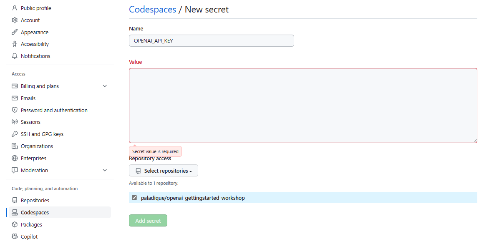

# Getting Started with OpenAI API

This repository is a collection of Jupyter Notebooks adapted from the [Azure OpenAI Samples Repository](https://github.com/Azure/azure-openai-samples) that include notebooks that access [OpenAI](notebooks-oai) and [Azure OpenAI](notebooks-azure-oai) services.

The Python OpenAI API works with Azure OpenAI Models as well, with a few modifications. Learn more about the differences here: [How to switch between OpenAI and Azure OpenAI endpoints with Python](https://learn.microsoft.com/azure/ai-services/openai/how-to/switching-endpoints?WT_mc_id=academic-109527-jasmineg)

## Requirements
 - A GitHub Account
 - OpenAI Key
 
##  Instructions
1. Fork, then open this repository in Codespaces.
2. Navigate to  [Settings > Codespaces](https://github.com/settings/codespaces), and create a new Codespaces secret called `OPENAI_API_KEY`
3. Select your forked repository under `Repository access`

## Learn more
- [Azure OpenAI on Microsoft Learn](https://learn.microsoft.com/training/modules/explore-azure-openai/?WT_mc_id=academic-109527-jasmineg)
- [Codespaces](https://docs.github.com/en/codespaces)
- [Have a idea that leverages AI? Learn more about how Microsoft can help you with the Founders Hub and Azure credits!](https://www.microsoft.com/startups/ai?WT_mc_id=academic-109527-jasmineg) 